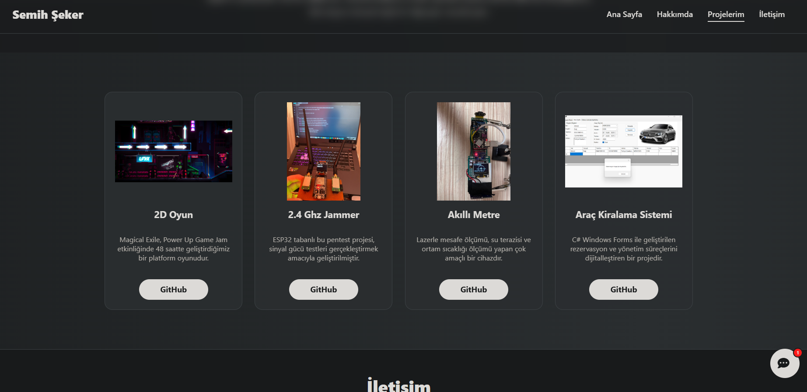
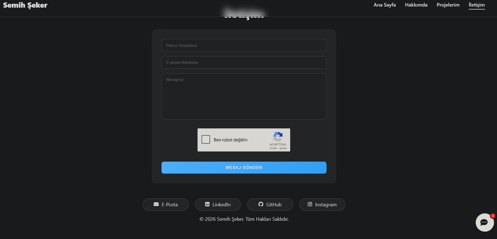

# Personal Portfolio — Semih Şeker

A personal portfolio website designed to showcase projects, technical background, and contact information. Built with vanilla HTML, CSS, and JavaScript, deployed via GitHub Pages.

## Live Site

[semihskr.github.io](https://sem1hX1.github.io/semihskr)

---

## Screenshots






---

## Features

- **Responsive design** — adapts to desktop and mobile screen sizes
- **Smooth scroll navigation** — fixed navbar with active section highlighting
- **Projects showcase** — card-based layout linking to individual GitHub repositories
- **Contact form** — EmailJS integration with reCAPTCHA spam protection
- **AI Chatbot** — Gemini API powered assistant that can answer questions about the site owner
- **Minimal dark theme** — clean black/white design without unnecessary visual clutter

---

## Tech Stack

| Layer | Technology |
|---|---|
| Markup | HTML5 |
| Styling | CSS3 (Vanilla) |
| Logic | JavaScript (ES6+) |
| Email | EmailJS |
| AI | Google Gemini API |
| Hosting | GitHub Pages |

---

## Project Structure

```
├── index.html       # Main page structure
├── index.css        # All styles
├── index.js         # Navigation, scroll, general interactions
├── chatbot.js       # AI chatbot logic and UI
└── readmeimg/       # Screenshots used in this README
```

---

## Projects Shown

| Project | Description |
|---|---|
| 2D Oyun | A 2D platform game developed in 48 hours for the Power Up Game Jam |
| 2.4 GHz Jammer | ESP32-based pentest device for signal strength testing |
| Akilli Metre | Multi-purpose IoT device with laser distance, water level, and temperature sensing |
| Arac Kiralama Sistemi | Vehicle rental and management system built with C# Windows Forms |

---

## Contact

- LinkedIn: [linkedin.com/in/semihskr](https://linkedin.com/in/semihskr)
- GitHub: [github.com/sem1hX1](https://github.com/sem1hX1)

---

&copy; 2026 Semih Şeker. All rights reserved.
